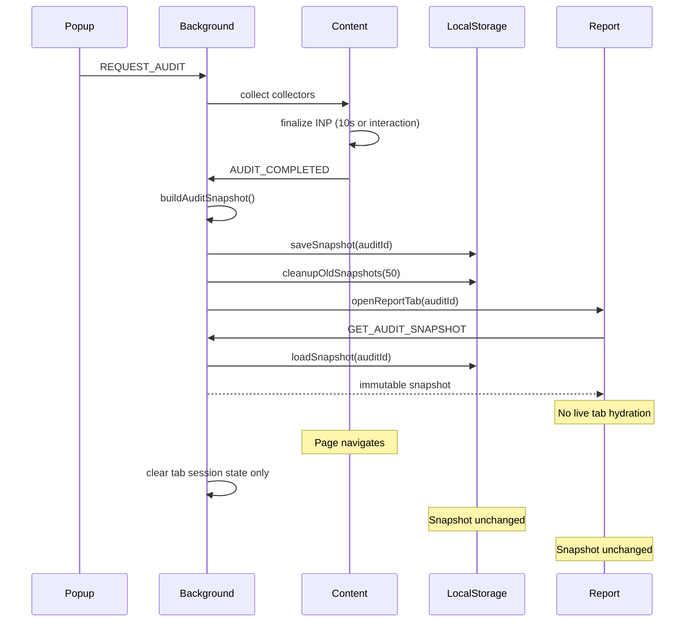

# Immutable Audit Snapshot Lifecycle

## Summary

Completed audits are frozen into **immutable `AuditSnapshot` objects** stored in `chrome.storage.local`. Reports load exclusively by `auditId` and are unaffected by navigation on the audited page.

---

## Updated Folder Structure

```
src/
├── shared/snapshots/
│   ├── types.ts              # AuditSnapshot, AuditSnapshotSummary
│   ├── constants.ts          # storage keys, REPORT_VERSION, MAX_SNAPSHOT_COUNT
│   ├── loadSnapshot.ts       # RPC helpers (popup/report → background)
│   └── index.ts
│
├── background/
│   ├── AuditSnapshotManager.ts   # save / load / list / delete / cleanup
│   ├── buildAuditSnapshot.ts     # derives analysis, score, enterprise, fix plan
│   └── auditOrchestrator.ts      # persists snapshot on AUDIT_COMPLETED
│
├── content/inp/
│   └── finalizeInp.ts            # 10s or first-interaction INP wait
│
└── report/
    ├── hooks/
    │   ├── useReportAuditId.ts     # ?auditId= from URL
    │   ├── useHydrateSnapshot.ts   # one-time GET_AUDIT_SNAPSHOT
    │   └── useSnapshotData.ts      # read-only snapshot accessors
    └── store/snapshotStore.ts
```

---

## Snapshot Architecture

```typescript
interface AuditSnapshot {
  auditId: string;              // UUID, canonical key
  tabId: number;                // source tab (metadata only)
  url: string;
  timestamp: number;
  reportVersion: string;
  auditResult: AuditResult;
  analysisResult: AnalysisResult;
  scoreResult: ScoreResult;
  enterpriseAuditResult: EnterpriseAuditReport;
  enterpriseScoreResult: EnterpriseScoreResult;
  fixPlan: FixPlan;
  frameworkProfile: FrameworkProfile;
}
```

**Built once** in the background via `buildAuditSnapshot()` when `AUDIT_COMPLETED` fires. Analysis, scoring, enterprise audit, and fix-plan engines are invoked at snapshot time — the report UI reads precomputed data and does not re-run engines.

---

## Lifecycle Diagram



---

## Report URL

```
chrome-extension://<id>/src/report/index.html?auditId=<uuid>#/overview
```

Popup and report communicate through **`auditId` only** for report access. Live tab state (`GET_LAST_AUDIT`) remains for the popup launcher progress UI.

---

## Storage Strategy

| Layer | Key | Purpose |
|-------|-----|---------|
| `chrome.storage.local` | `ai_performance_auditor_snapshots:<auditId>` | Full immutable snapshot |
| `chrome.storage.local` | `ai_performance_auditor_snapshot_index` | Ordered auditId list (newest first) |
| `chrome.storage.session` | `ai_performance_auditor_tab_audits` | Live per-tab state (popup only) |

**Index + keyed records** allow O(1) load by id and efficient listing without scanning all storage keys.

---

## Cleanup Strategy

| Trigger | Behavior |
|---------|----------|
| After each save | `cleanupOldSnapshots(50)` — drop oldest beyond 50 |
| User action | History page → `DELETE_AUDIT_SNAPSHOT` |
| Report tab closed | Snapshot retained (reopenable from History) |
| Tab navigation | Session tab audit cleared; **snapshots never cleared** |

---

## INP Finalization

1. Collectors run normally; WebVitals uses a **3s LCP/CLS window** (INP deferred).
2. If INP status is `waiting-for-interaction`, `finalizeInpIfNeeded()` runs before `AUDIT_COMPLETED`:
   - Wait up to **10 seconds** OR **first user interaction** (click, scroll, keydown, pointer, wheel, touch)
   - Progress messages: `Waiting for first interaction…` → `INP captured` → `Finalizing report…`
   - Timeout: INP marked **`not-measured`**; all other metrics preserved

---

## New Message Types

| Type | Purpose |
|------|---------|
| `GET_AUDIT_SNAPSHOT` | Load snapshot by `auditId` |
| `LIST_AUDIT_SNAPSHOTS` | List summaries (history UI) |
| `DELETE_AUDIT_SNAPSHOT` | User-initiated removal |

`EXPLAIN_FIX` accepts optional `auditId` so AI explanations use snapshot data from reports.

---

## Build Verification

```bash
npm run build   # ✓
npm test        # ✓ 8 tests
```

Reload unpacked from `dist/`. Run an audit → report opens with `?auditId=` → navigate the audited page → report remains unchanged.
